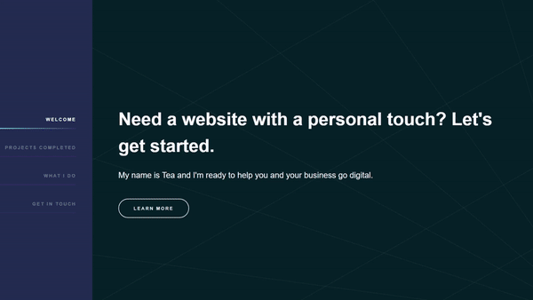
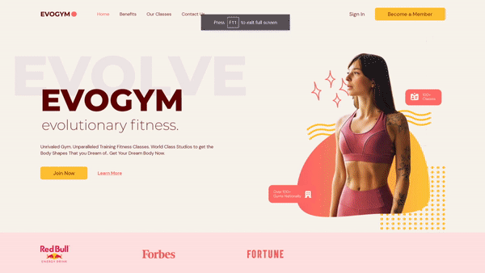
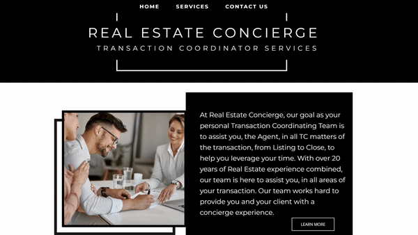
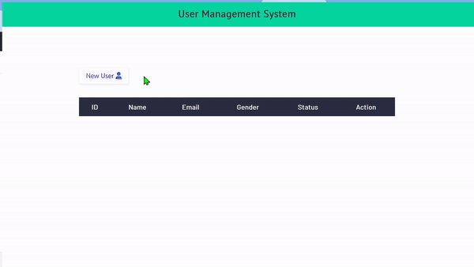
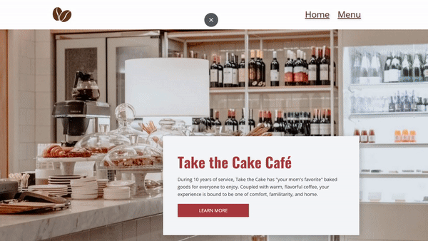

# Welcome to ControlAltTea!

### Hello, my name is Tea. I am a fullstack software engineer using the MERN stack, with a background in game development, graphic design, and special education, leading with accessibility at every step of development. If you see anything that requires better means of accessibility, please feel free to submit a PR and we can collaborate!

## Below are my various networks:

  
  
  

<h2 align="center">Technologies</h2>

    
    
    
    
    
    
    
    

<!-- <tr>
<td width="50%" align="left">

 </td>
<td width="50%" align="right">
<h1 align="center">Technologies</h1>

  <ul align="center">
    <li>
    </li>
    <li></li>
    <li>
    </li>
    <li>
    </li>
    <li>
    </li>
    <li>
    </li>
    <li>
    </li>
    <li>
    </li>
  </ul>
</td> -->
<!--  -->
</tr>

<h1 align="center">Projects</h1>
<table bordercolor="#66b2b2">
<tr>
     <td width="50%" valign="top">
        <h3 align="center">Portfolio</h3>
         
            
         
        

            
            
        

        
<strong>HTML5, CSS3, & JavaScript</strong> - Portfolio Site including links to my projects and ways to get in contact with me.

    </td>
   <td width="50%" valign="top">
        <h3 align="center">Fitness App</h3>
         
            
         
        

            
            
        

        
<strong>HTML5, CSS3,  Tailwind, React, Vite & TypeScript</strong> - Unrivaled Gym. Unparalleled Training Fitness Classes. World Class Studios to get the Body Shapes That you Dream of.. Get Your Dream Body Now.

    </td>
</tr>        
<tr>
      <td width="50%" valign="top">
        <h3 align="center">Real Estate Concierge</h3>
         
            
         
        

            
        

        
<strong>Netlify, HTML5, CSS3, & JavaScript</strong> - At Real Estate Concierge, our goal as your personal Transaction Coordinating Team is to assist you, the Agent, in all TC matters of the transaction, from Listing to Close, to help you leverage your time.

    </td>
      <td width="50%" valign="top">
        <h3 align="center">Stories App with Google Auth</h3>
         
            
         
        

            
        

        
<strong>HTML5, CSS3, Handlebars (.hbs), MongoDB, & JavaScript</strong> - Using Google Authorization and Handlebar partials, this web app allows the user to create a blog style application.

    </td>
</tr>

<tr>
      <td width="50%" valign="top">
        <h3 align="center">User Management System</h3>
         
    

        
         
            
    

        
<strong>JavaScript, HTML5, CSS3, MongoDB, EJS</strong> - This user management system allows users to create, read, update, and delete user information stored in the system's database.

    </td>
    <td width="50%" valign="top">
        <h3 align="center">Fresh Cuts by Jae</h3>
         
            
         
        

            
        

        
<strong>JavaScript, HTML5, CSS3, & Netlify</strong> - "As a family-owned business, we at Fresh Cuts by Jae take the utmost care in your cut's precision. Through modern sculpting, your cuts will have you leaving feel fresh and confident in your appearance."

    </td>

  </tr>

<tr>
   <td width="50%" valign="top">
        <h3 align="center">CtrlAltDelete</h3>
         
            
         
        

            
        

        
<strong>HTML5, CSS3, & JavaScript</strong> - "Welcome to CtrlAltDelete,
your hub of choice for computer repair and customization"

    </td>
<td width="50%" valign="top">
        <h3 align="center">Take the Cake Cafe</h3>
         
            
         
        

            
        

        
<strong>HTML5, CSS3, & JavaScript</strong> - "During 10 years of service, Take the Cake has "your mom's favorite" baked goods for everyone to enjoy. Coupled with warm, flavorful coffee, your experience is bound to be one of comfort, familitarity, and home."

    </td>
</tr>
</table>
<!--
**ControlAltTea/ControlAltTea** is a ✨ _special_ ✨ repository because its `README.md` (this file) appears on your GitHub profile.

Here are some ideas to get you started:

- 🔭 I’m currently working on ...
- 🌱 I’m currently learning ...
- 👯 I’m looking to collaborate on ...
- 🤔 I’m looking for help with ...
- 💬 Ask me about ...
- 📫 How to reach me: ...
- 😄 Pronouns: ...
- ⚡ Fun fact: ...
-->
