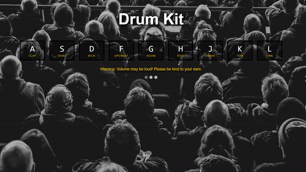
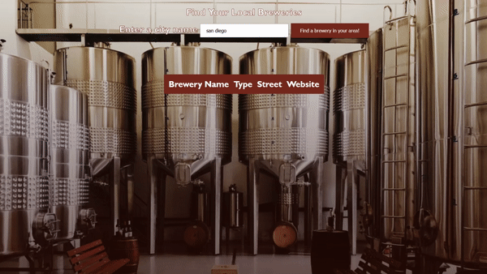
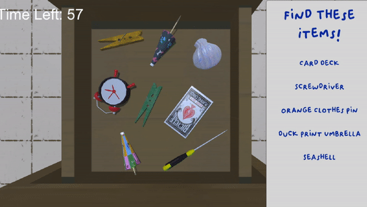

# Welcome to ControlAltTea!

### Hello, my name is Tea. I am a fullstack software engineer using the MERN stack, with a background in game design and special education, leading with accessibility at every step of development. If you see anything that requires better means of accessibility, please feel free to submit a PR and we can collaborate!

## Below are my various networks:

  
  
  

<h1 align="center">Projects</h1>
<table bordercolor="#66b2b2">
<tr>
 <td width="50%" valign="top">
            <h3 align="center">Tea's Portfolio</h3>
         
        
         
        

  
  
      

        
<strong>HTML5, CSS3, & JavaScript</strong> - Portfolio Site including links to my projects and ways to get in contact with me.

    </td>
<td width="50%" valign="top">
      <h3 align="center">User Management System</h3>
         
   

        
         
         
  

        
<strong>JavaScript, HTML5, CSS3, MongoDB, EJS</strong> - This user management system allows users to create, read, update, and delete user information stored in the system's database.

    </td>
  </tr>        
  <!--   

        

          
   -->
  <tr>
  
<td width="50%" valign="top">
            <h3 align="center">Tea's Instrument Kit</h3>
         
        
         
        

  
  
      

        
<strong>HTML5, CSS3, & JavaScript</strong> - Any interactive instrument kit, including drums, piano, and guitar via your web browser!

</td>
<td width="50%" valign="top">
      <h3 align="center">Find Your Ghibli</h3>
         
        
         
        

          
    
  
      

        
<strong>JavaScript, HTML5, CSS3, & Netlify</strong> - This API testing is being used to pull different pieces of information from the Studio Ghibli API found at: <a href="https://ghibliapi.herokuapp.com/films/">https://ghibliapi.herokuapp.com/films/</a>

    </td>
</tr>

<tr>
 <td width="50%" valign="top">
            <h3 align="center">Clocks App (WIP)</h3>
         
        
         
        

  
  
      

        
<strong>JavaScript & React (Pending)</strong> - A clock app that can display the weather depending on the zip code or location entered by the user. This project is still currently in development.

    </td>
</tr>

<tr>
<td width="50%" valign="top">
            <h3 align="center">Brewery Finder</h3>
         
            
        </a>
         
        

  
  
      

        
<strong>HTML5, CSS3, & JavaScript</strong> - Need to find a brewery local to you? Enter your city and see if we can find any nearby!

</td>
    <td width="50%" valign="top">
            <h3 align="center">iSpy Game</h3>
         
        
         
        

    
        

        
<strong>C# in the Unity Engine, Blender, & Substance Painter</strong> - A game in exercing shaders. The premise is your basic i-Spy game! Find the item on the list before the clock runs out.

    </td>
</tr>
</table>

<h1 align="center">Technologies</h1>

    
    
    
    
    
    
    
    

<!--
**ControlAltTea/ControlAltTea** is a ✨ _special_ ✨ repository because its `README.md` (this file) appears on your GitHub profile.

Here are some ideas to get you started:

- 🔭 I’m currently working on ...
- 🌱 I’m currently learning ...
- 👯 I’m looking to collaborate on ...
- 🤔 I’m looking for help with ...
- 💬 Ask me about ...
- 📫 How to reach me: ...
- 😄 Pronouns: ...
- ⚡ Fun fact: ...
-->
